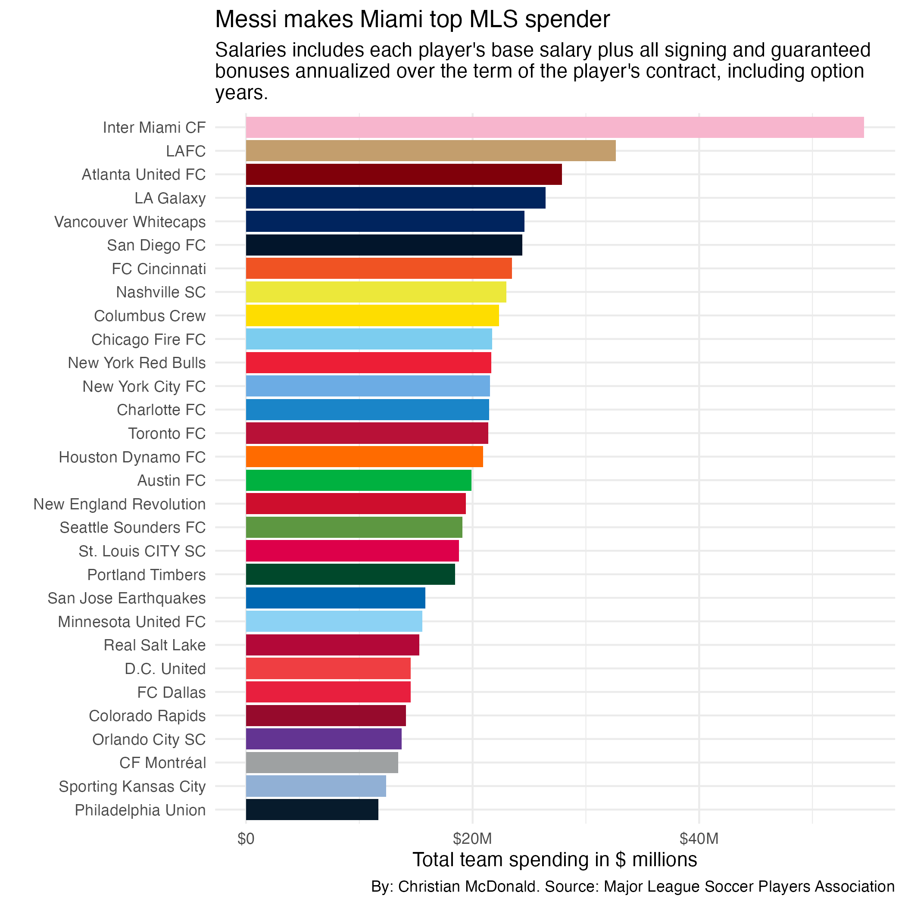
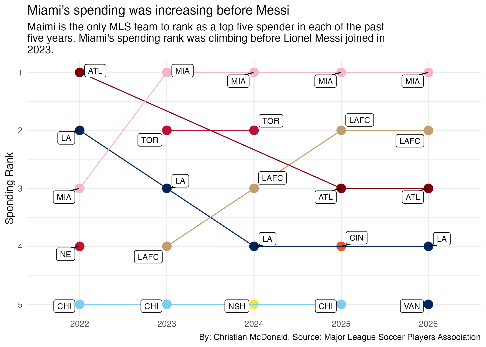

## Goals of this notebook

::: callout-important
This analysis is current through the Spring 2026 data release by the [MLSPA](https://mlsplayers.org/resources/salary-guide). While released on May 12, the data is for all MLS players under contract as of April 16, 2026.
:::

We'll explore MLS Salaries through history. We'll start with the most recent data, then look back historically. A couple of questions that come to mind:

- Which players are getting paid the most this year?
- Which teams have the highest salary bill this year?
- How do team salary rankings compare over time?

[Per the MLS Player's Association](https://mlsplayers.org/resources/salary-guide), "compensation" is: The Annual Average Guaranteed Compensation (Guaranteed Comp) number includes a player's base salary and all signing and guaranteed bonuses annualized over the term of the player's contract, including option years.

## Setup

```{r}
#| label: setup
#| echo: true
#| results: hide
#| message: false
#| warning: false

library(tidyverse)
library(janitor)
library(scales)
library(ggrepel)
library(DT)

options(dplyr.summarise.inform = FALSE)
options(scipen = 999)
```


## Import

### Cleaned salary data

```{r}
salaries <- read_rds("data-processed/mls-salaries.rds")

salaries |> glimpse()
```

### Team colors data

You can see in [MLS colors](99-mls-colors.qmd) how I manually built these colors (and why).

```{r}
# download.file("https://docs.google.com/spreadsheets/d/e/2PACX-1vQqXJxbbrBsikirZrGyXYV_G6cFZp_dYmcf52UfSYM7Kw3akGlkO5jKP8ZL8WtRA5qUJgFMNPG8JYov/pub?output=csv&&gid=1348329208", "data-processed/clubs-colors.csv")

mls_colors_data <- read_csv("data-processed/clubs-colors.csv")

mls_colors_data |> glimpse()
```

### Setting the most recent year of data

I'm creating an object called `recent_year` because at some point I'll have new data and might want to just change the year.

```{r}
recent_year <- "2026"
```


## Players with highest salaries

### Of all time

Looking at total compensation, these are all the players who have made $5M or more in a single season.

```{r}
salaries |> 
  arrange(compensation |> desc()) |> 
  select(!c(club_long, conference)) |> 
  filter(compensation >= 5000000)
```


### Since 2015

A searchable table of MLS players since 2015. (We can't do this for all players because the table gets too large to publish.)

```{r}
sal_high <- salaries |> 
  filter(year >= 2015) |> 
  arrange(compensation |> desc()) |> 
  select(!c(club_long, conference))

sal_high |> datatable()
```

#### Data takeaway: Messi money

Upon his signing on July 15, 2023, Lionel Messi became the highest paid player in the history of the MLS with a total compensation of \$20.4 million. Lorenzo Insigne of Toronto was second at the time with \$15.5 million, the only other player earning more than $10 million within a year.

### In most recent year: `r recent_year`

```{r}
sal_high_recent <- salaries |> 
  filter(year == recent_year) |> 
  mutate(rank = min_rank(desc(compensation))) |> 
  relocate(rank) |> 
  arrange(compensation |> desc()) |> 
  select(!c(club_long, conference))

sal_high_recent
```

Teams with more than one player from top 10

```{r}
sal_high_recent |> 
  filter(rank <= 10) |> 
  count(club_short, sort = T) |> 
  filter(n > 1)
```

#### Data takeaway: More than Messi

Inter Miami and Nashville both have two players in the list of top 10 earners.

### Difference with just base pay in `r recent_year`?

This looks at just the base salary as opposed to total compensation. No great changes at the top of the list.

```{r}
sal_high_base <- salaries |> 
  arrange(base_salary |> desc()) |> 
  select(!c(club_long, conference, compensation))

sal_high_base |> filter(year == recent_year, base_salary >= 2000000) 
```

### Hightest paid on Austin FC

Since we are in Austin, let's look at their roster.

```{r}
sal_high_recent |> 
  filter(club_short == "ATX")
```

## Team salaries

We'll get per-year salaries by team, then look at just this year.

### Highest team salaries over time

First get the total compensation for each team in each year. These are only teams who spend more than $20 million.

```{r}
sal_team <- salaries |> 
  group_by(year, club_long) |> 
  summarise(total_compensation = sum(compensation)) |> 
  arrange(total_compensation |> desc())

# peek at the top
sal_team |> filter(total_compensation > 20000000)
```

Then find the top team for each year.

```{r}
#| message: false
top_sal_team_yr <- salaries |> 
  group_by(year, club_long) |> 
  summarise(total_compensation = sum(compensation)) |> 
  slice_max(total_compensation)

top_sal_team_yr
```

And note how often the teams have been the top spender.

```{r}
top_sal_team_yr |> 
  ungroup() |> 
  tabyl(club_long) |> 
  adorn_totals("row") |>
  adorn_pct_formatting() |> 
  as_tibble()
```

#### Data takeaways: Toronto historically spends high

Looking at the most expensive rosters in the MLS of time, Toronto FC has seen of the top 10 highest entries. Over the past 17 years, Toronto has been the top spending team seven times, or 40% of the time. The L.A. Galaxy is next with five highest-spending years.

### Highest salaries this year

And let's look at this year.

```{r}
sal_team_recent <- sal_team |> filter(year == recent_year) |> 
  filter(club_long != "Major League Soccer")

# peek
sal_team_recent
```

#### Prep data for chart

Let's round the numbers for our chart.

```{r}
sal_team_recent_mil <- sal_team_recent |> 
  mutate(total_millions = (total_compensation / 1000000) |> round(1)) |> 
  left_join(
    mls_colors_data |> select(club_long, favored_color, favored_nohex),
    join_by(club_long)
  ) |>
  drop_na(favored_color)

sal_team_recent_mil
```

#### Let's chart this

```{r}
#| label: fig-team-salary-recent
#| fig-cap: "Messi drives Miami team salary"
#| fig-alt: "Bar chart showing MLS team salaries from highest to lowest."

sal_team_recent_mil_plot <- sal_team_recent_mil |> 
  ggplot(aes(
    x = total_compensation,
    y = club_long |> reorder(total_compensation)
  )) +
  geom_col(fill = sal_team_recent_mil$favored_color) +
  scale_x_continuous(labels = label_dollar(scale_cut = cut_long_scale()),
                     # limits = c(0,50000000)
                     ) +
  # geom_text(aes(label = paste("$", as.character(total_millions), sep = "")), color = "black", hjust = -.25) +
  labs(
    x = "Total team spending in $ millions",
    y = "",
    title = "Messi makes Miami top MLS spender",
    subtitle = str_wrap("Salaries includes each player's base salary plus all signing and guaranteed bonuses annualized over the term of the player's contract, including option years."),
    caption = "By: Christian McDonald. Source: Major League Soccer Players Association"
  ) +
  theme_minimal()

ggsave("figures/team-salary-recent.png", width = 7, height = 7)
```




One more look to see how many high-paid players on each team.

```{r}
sal_high_recent |> 
  filter(compensation >= 5000000) |> 
  count(club_short, sort = T)
```

### More than Messi

Which teams pay their entire team less than what the highest player makes?

```{r}
top_player <- sal_high_recent |> 
  filter(!is.na(club_short)) |> 
  filter(rank == 1)

top_player_name <- 
  paste(top_player$first_name, top_player$last_name)

highest_comp <- top_player |> 
  pull(compensation)

more_than_top <- sal_high_recent |> 
  filter(!is.na(club_short)) |> 
  group_by(club_short) |> 
  summarise(total_comp = sum(compensation, na.rm = T)) |> 
  filter(total_comp < highest_comp)

more_than_top_nrow <- more_than_top |> nrow()

```

In `r recent_year` the highest paid player was `r top_player_name` making `r scales::dollar(highest_comp)`. There are `r more_than_top_nrow` teams that pay less than that for their entire roster.

### Team spending over time

Let's look at team spending over the past five years. To do this, we have to create a ranking for the spending.

- I'm removing players not affiliated with teams
- When I added a third column to the group because I wanted to use long names for something, the ranking broke. I had to break the group then use the `.by` argument for `rank()`.


```{r}
sal_team_rank <- salaries |> 
  filter(club_short != "MLS" | club_short |> is.na()) |> 
  group_by(year, club_short, club_long) |> 
  summarise(
    total_comp = sum(compensation, na.rm = TRUE)
  ) |> 
  arrange(year, total_comp |> desc()) |> 
  ungroup() |> #<1>
  mutate(rank = rank(-total_comp), .by = year) #<2>

# peek
sal_team_rank |> head(20)
```

1. I break the `group_by` here.
2. Then I set the ranking to work by year.

Visualizing all of them would be tricky. Let's do the top five over last five years.

```{r}
sal_team_rank_top <- sal_team_rank |> 
  filter(rank <= 5,
         year >= (as.numeric(recent_year) - 4)) |> 
  left_join(mls_colors_data |> select(club_short, favored_color, favored_nohex), join_by(club_short))

sal_team_rank_top |> 
  filter(club_short == "MIA")
```

Peek at this a different way

```{r}
sal_team_rank_top |> 
  select(-total_comp) |> 
  pivot_wider(names_from = year, values_from = rank) |> 
  select(!c(club_long, favored_color, favored_nohex))
```

### Let's visualze spending rank


```{r}
#| label: chart_rank_t5

sal_team_rank_top_plot <- sal_team_rank_top |> 
  ggplot(aes(x=year, y=rank, color = favored_color, group = club_short)) +
  geom_point(size = 4) +
  geom_line() +
  scale_y_reverse() +
  scale_color_identity(aes(color = favored_color)) +
  geom_label_repel(aes(label = club_short), color = "black", size = 3) +
  labs(
    title = "Miami's spending was increasing before Messi",
subtitle = str_wrap("Maimi is the only MLS team to rank as a top five spender in each of the past five years. Miami's spending rank was climbing before Lionel Messi joined in 2023."),
    color = "Club",
    x = NULL,
    y = "Spending Rank",
    caption = "By: Christian McDonald. Source: Major League Soccer Players Association"
  ) +
  theme_minimal()


ggsave("figures/sal_team_rank.png")
ggsave("figures/sal_team_rank.jpg")
```



Let's count how many times each team is in this list.

```{r}
sal_team_rank_top |> 
  count(club_long, sort = T)
```


#### Data Takeaway: Miami and the LAs

Only Miami has been among the top spending teams over the past five years. The two L.A. teams are the only teams to rank in the top 5 for four years.


